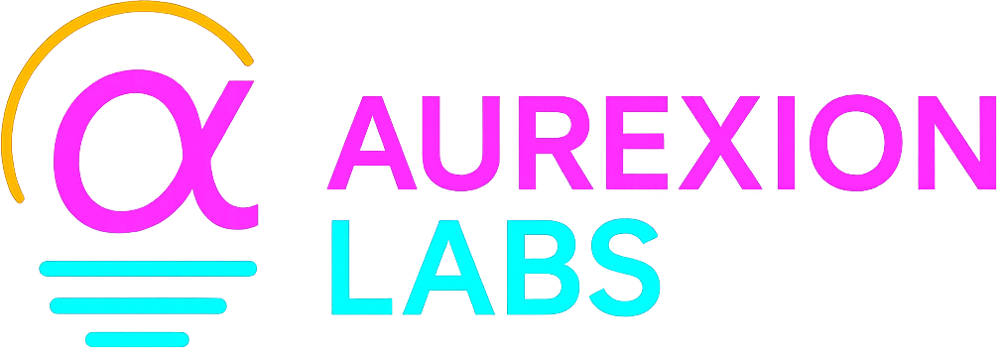

# 

  

This repository contains the **frontend code** for the Aurexion Labs store, including the landing pages, header/footer components, and styling.  

It’s built with **plain HTML, CSS, and JavaScript**, no frameworks, for simplicity and maintainability.  

## Demo

The live version of the site is available at: [https://aurexionlabs.com](https://aurexionlabs.com)

## Structure

- `index.html` – main landing page
- `css/` – stylesheets
- `js/` – scripts
- `components/` – reusable components (header, footer)
- `assets/` – images, icons, etc.
